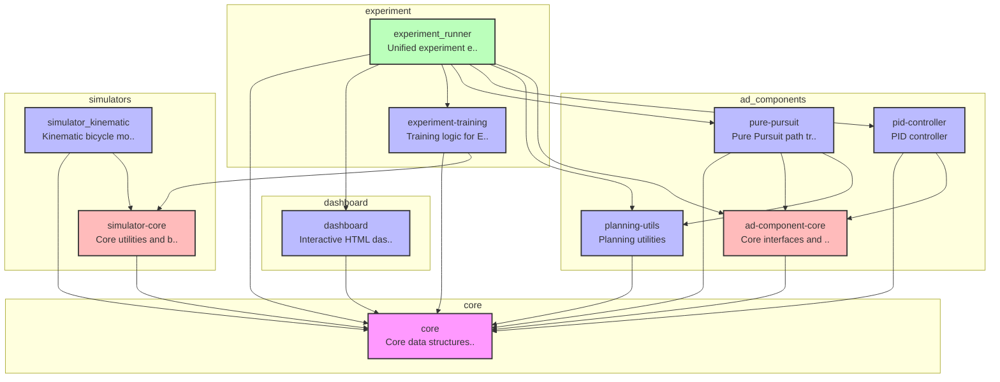
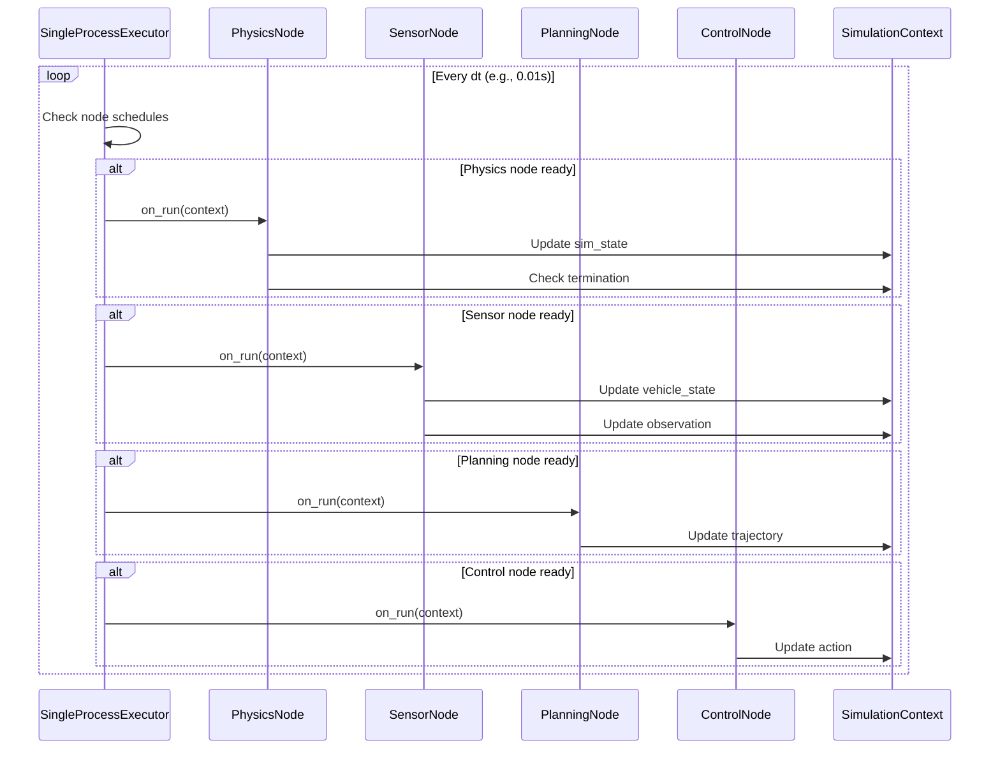

# E2E AI Challenge Playground

自動運転の認識・計画・制御コンポーネントを柔軟に組み合わせて実験できるプラットフォーム。

---

## 🚀 クイックスタート

### 必要な環境

- uv
- Docker

### セットアップと実行

```bash
# 1. リポジトリをクローン
git clone https://github.com/masahiro-kubota/e2e_aichallenge_playground.git
cd e2e_aichallenge_playground

# 2. 依存関係をインストール
uv sync

# 3. 実験トラッキングサーバーを起動（MLflow + MinIO）
cd mlflow
docker compose up -d
cd ..

# 4. 実験を実行

# データ収集（Pure Pursuit）
# データは自動的にMinIO (s3://datasets/...) にアップロードされます
uv run experiment-runner --config experiment/configs/experiments/data_collection_pure_pursuit.yaml

# 学習（Imitation Learning）
# MinIOからデータを自動ダウンロードして学習します
uv run experiment-runner --config experiment/configs/experiments/imitation_learning_s3.yaml

# 評価（Pure Pursuit）
uv run experiment-runner --config experiment/configs/experiments/pure_pursuit.yaml

# 5. 結果を確認
# MLflow UI: http://localhost:5000
# MinIO Console: http://localhost:9001 (minioadmin / minioadmin)
```

### サーバーの停止

```bash
cd mlflow
docker compose down  # データを保持
docker compose down -v  # データも削除
```

---

## 📊 CI/CD & Dashboard

| Status | Description |
| :--- | :--- |
| [](https://github.com/masahiro-kubota/e2e_aichallenge_playground/actions/workflows/unit-tests.yml) | 単体テスト |
| [](https://github.com/masahiro-kubota/e2e_aichallenge_playground/actions/workflows/integration-tests.yml) | 統合テスト |
| [](https://codecov.io/gh/masahiro-kubota/e2e_aichallenge_playground) | テストカバレッジ |
| [**Simulation Dashboard**](https://masahiro-kubota.github.io/e2e_aichallenge_playground/) | 最新のテスト結果（シミュレーションダッシュボード） |
| [**Sphinx Documentation**](https://masahiro-kubota.github.io/e2e_aichallenge_playground/docs/) | プロジェクトドキュメント (API Reference) |

---

## 📁 ディレクトリ構成

### アーキテクチャ

```
e2e_aichallenge_playground/
├── core/                           # プロジェクト基盤（データ構造・インターフェース）
├── ad_components/             # コンポーネントパッケージ
│   ├── core/                      # コンポーネント共通基盤
│   ├── planning/                  # 計画コンポーネント
│   │   ├── pure_pursuit/
│   │   └── planning_utils/
│   └── control/                   # 制御コンポーネント
│       ├── pid_controller/
│       └── neural_controller/
├── simulators/                    # シミュレータ実装
│   ├── core/                     # シミュレータ基底クラス (simulators_core)
│   └── simulator_kinematic/      # 運動学シミュレータ
├── experiment/
│   ├── runner/                   # 統一実験実行フレームワーク
│   ├── training/                 # 学習機能（Dataset, Trainer）
│   └── configs/                  # 実験設定ファイル
│       ├── experiments/          # 実験設定
│       ├── vehicles/             # 車両パラメータ
│       └── scenes/               # シーン設定
├── dashboard/                    # 可視化ダッシュボード
├── data/                         # 一時データ（Git対象外）
└── mlflow/                       # MLflow + MinIO サーバー
```

### アーキテクチャ概要

> **Note**: この図は `scripts/generate_architecture_diagram.py` によって自動生成されています。更新する際は以下のコマンドを実行してください：
> ```bash
> uv run python scripts/generate_architecture_diagram.py
> ```

<!-- ARCHITECTURE_DIAGRAM_START -->

<!-- ARCHITECTURE_DIAGRAM_END -->

---

## 🏗️ アーキテクチャ詳細

### SingleProcessExecutor

このプロジェクトでは、**SingleProcessExecutor**を使用してシミュレーションを実行します。これは、複数のノード（Physics、Sensor、Planning、Control）を単一プロセス内で協調動作させる実行エンジンです。

#### Node Provider パターン

ADComponent（自動運転コンポーネント）は**Node Provider**として機能し、実行可能なノードのリストを提供します：

```python
class ADComponent(ABC):
    """自動運転コンポーネントの抽象基底クラス"""

    @abstractmethod
    def get_schedulable_nodes(self) -> list[Node]:
        """実行可能なノードのリストを返す"""
        pass
```

#### ノードの種類

各ノードは特定の周波数で実行され、`SimulationContext`を通じてデータを共有します：

| ノード | 役割 | 典型的な周波数 |
|--------|------|----------------|
| **PhysicsNode** | シミュレータの物理演算を実行 | 10-100 Hz |
| **SensorNode** | センサーデータの取得・処理 | 10-50 Hz |
| **PlanningNode** | 経路計画・軌道生成 | 5-10 Hz |
| **ControlNode** | 車両制御コマンド生成 | 10-50 Hz |

#### 実行フロー



#### FlexibleADComponent

`FlexibleADComponent`は、設定ファイルに基づいて動的にノードを構築・接続する標準実装です。
YAML設定でパイプラインを定義できるため、コードを変更せずにセンサー、認識、計画、制御の構成を変更できます。

```python
class FlexibleADComponent(ADComponent):
    def __init__(self, vehicle_params, nodes, **kwargs):
        # 設定からノードを動的に構築
        for node_config in nodes:
            processor = self._create_processor(node_config["processor"], vehicle_params)
            node = GenericProcessingNode(
                name=node_config["name"],
                processor=processor,
                io_spec=NodeIO(**node_config["io"]),
                rate_hz=node_config["rate_hz"],
            )
            self.nodes_list.append(node)
```

#### 設定例

```yaml
# experiment/configs/modules/pure_pursuit_pid.yaml
module:
  name: "pure_pursuit_pid"
  components:
    ad_component:
      type: "experiment_runner.flexible_ad_component.FlexibleADComponent"
      params:
        nodes:
          - name: "Sensor"
            processor:
              type: "core.processors.sensor.IdealSensorProcessor"
            io:
              inputs: ["sim_state"]
              output: "vehicle_state"
            rate_hz: 50.0

          - name: "Planning"
            processor:
              type: "core.adapters.planner_adapter.PlannerAdapter"
              params:
                planner:
                  type: "pure_pursuit.PurePursuitPlanner"
                  params:
                    lookahead_distance: 5.0
                    track_path: "path/to/track.csv"
            io:
              inputs: ["vehicle_state", "observation"]
              output: "trajectory"
            rate_hz: 10.0

          - name: "Control"
            processor:
              type: "core.adapters.controller_adapter.ControllerAdapter"
              params:
                controller:
                  type: "pid_controller.PIDController"
                  params:
                    kp: 1.0
            io:
              inputs: ["trajectory", "vehicle_state", "observation"]
              output: "action"
            rate_hz: 30.0

    simulator:
      type: "KinematicSimulator"
      params:
        dt: 0.1
```

#### 利点

1. **柔軟性**: 各ノードの実行周波数を独立して設定可能
2. **モジュール性**: ノードの追加・削除が容易
3. **デバッグ性**: 各ノードの動作を個別に検証可能
4. **拡張性**: 新しいノードタイプ（例: Perception）を簡単に追加可能

---

## 📖 開発フロー

### 基本的な実験実行

```bash
# Pure Pursuit コントローラーでシミュレーション
uv run experiment-runner --config experiment/configs/experiments/pure_pursuit.yaml

# Imitation Learning（ニューラルコントローラー）でシミュレーション
uv run experiment-runner --config experiment/configs/experiments/imitation_learning.yaml
```

### テストの実行

> **注意**: ROSがインストールされている環境では、`PYTHONPATH`環境変数にROSのパスが含まれているため、pytestが干渉を受けます。`PYTHONPATH=""`を付けてテストを実行してください。

```bash
# 全テストの実行
PYTHONPATH="" uv run pytest

# 統合テストの実行
PYTHONPATH="" uv run pytest -m integration -v

# 統合テストを除外（単体テストのみ）
PYTHONPATH="" uv run pytest -m "not integration"

# 特定のテストファイルを実行
PYTHONPATH="" uv run pytest core/tests/test_config.py -v

# Pre-commitフックの実行（全ファイル）
uv run pre-commit run --all-files
```


### コンポーネントの組み合わせ

設定ファイルでコンポーネントを自由に組み合わせ：

```yaml
# experiment/configs/experiments/custom.yaml
experiment:
  name: "custom_experiment"
  type: "evaluation"
  description: "Custom experiment example with layered config"

# システム構成（車両、シーン、モジュール指定）
system: "experiment/configs/systems/kart_default_track.yaml"

# 実験ごとの上書き設定
overrides:
  components:
    ad_component:
      params:
        planning:
          params:
            lookahead_distance: 7.5  # デフォルト値を上書き
        control:
          params:
            kp: 1.2

  execution:
    num_episodes: 5
```
