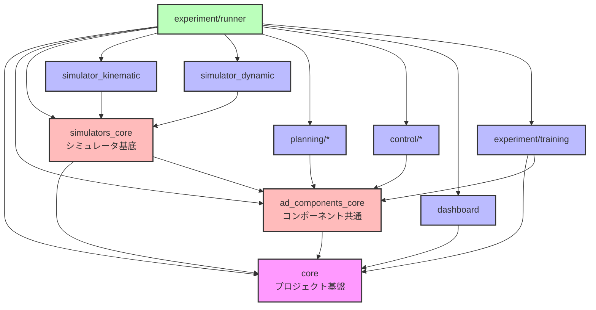
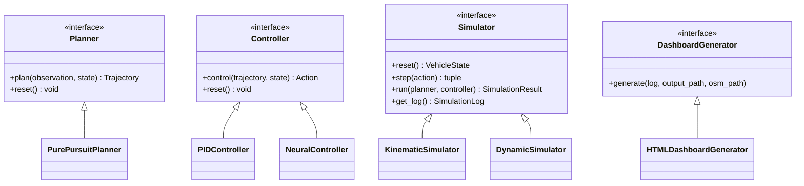

# E2E AI Challenge Playground

自動運転の認識・計画・制御コンポーネントを柔軟に組み合わせて実験できるプラットフォーム。

---

## 🚀 クイックスタート

### 必要な環境

- uv
- Docker

### セットアップと実行

```bash
# 1. リポジトリをクローン
git clone https://github.com/masahiro-kubota/e2e_aichallenge_playground.git
cd e2e_aichallenge_playground

# 2. 依存関係をインストール
uv sync

# 3. 実験トラッキングサーバーを起動（MLflow + MinIO）
cd mlflow
docker compose up -d
cd ..

# 4. 実験を実行

# データ収集（Pure Pursuit）
# データは自動的にMinIO (s3://datasets/...) にアップロードされます
uv run experiment-runner --config experiment/configs/experiments/data_collection_pure_pursuit.yaml

# 学習（Imitation Learning）
# MinIOからデータを自動ダウンロードして学習します
uv run experiment-runner --config experiment/configs/experiments/imitation_learning_s3.yaml

# 評価（Pure Pursuit）
uv run experiment-runner --config experiment/configs/experiments/pure_pursuit.yaml

# 5. 結果を確認
# MLflow UI: http://localhost:5000
# MinIO Console: http://localhost:9001 (minioadmin / minioadmin)
```

### サーバーの停止

```bash
cd mlflow
docker compose down  # データを保持
docker compose down -v  # データも削除
```

---

## 📊 CI/CD & Dashboard

| Status | Description |
| :--- | :--- |
| [](https://github.com/masahiro-kubota/e2e_aichallenge_playground/actions/workflows/integration-tests.yml) | 最新の統合テスト実行ステータス |
| [**Simulation Dashboard**](https://masahiro-kubota.github.io/e2e_aichallenge_playground/) | 最新のテスト結果（シミュレーションダッシュボード） |

---

## 📁 ディレクトリ構成

### アーキテクチャ

```
e2e_aichallenge_playground/
├── core/                           # プロジェクト基盤（データ構造・インターフェース）
├── ad_components/             # コンポーネントパッケージ
│   ├── core/                      # コンポーネント共通基盤
│   ├── planning/                  # 計画コンポーネント
│   │   ├── pure_pursuit/
│   │   └── planning_utils/
│   └── control/                   # 制御コンポーネント
│       ├── pid_controller/
│       └── neural_controller/
├── simulators/                    # シミュレータ実装
│   ├── core/                     # シミュレータ基底クラス (simulators_core)
│   ├── simulator_kinematic/      # 運動学シミュレータ
│   └── simulator_dynamic/        # 動力学シミュレータ
├── experiment/
│   ├── runner/                   # 統一実験実行フレームワーク
│   ├── training/                 # 学習機能（Dataset, Trainer）
│   └── configs/                  # 実験設定ファイル
│       ├── experiments/          # 実験設定
│       ├── vehicles/             # 車両パラメータ
│       └── scenes/               # シーン設定
├── dashboard/                    # 可視化ダッシュボード
├── data/                         # 一時データ（Git対象外）
└── mlflow/                       # MLflow + MinIO サーバー
```

### アーキテクチャ概要



### コアインターフェース

`core` と `ad_components_core` パッケージが、全てのコンポーネントが準拠すべきインターフェースを定義しています。



### パッケージ詳細

#### 📦 `core/` - コアフレームワーク
**責務**: プロジェクト全体の基盤となるデータ構造とインターフェース定義。

**主要な型**:
- **AD Components**: `VehicleState`, `Action`, `Trajectory`, `Sensing`, `ADComponentConfig`, `ADComponentLog`
- **Experiment**: `ExperimentConfig`, `ExperimentResult`
- **Simulation**: `SimulationConfig`, `SimulationResult`, `SimulationLog`, `SimulationStep`
- **Environment**: `Scene`, `TrackBoundary`, `Obstacle`
- **Vehicle**: `VehicleParameters`

**インターフェース**: `Simulator`, `DashboardGenerator`, `ExperimentRunner`

**依存関係**: `ad_components_core`

#### 🧩 `ad_components/core/` - コンポーネント共通基盤
**責務**: 自動運転コンポーネント間で共有されるインターフェースとデータ型。

**主要な型**:
- `Observation` - コンポーネントが使用する観測データ
- `Trajectory`, `TrajectoryPoint` - 軌道データ

**インターフェース**: `Planner`, `Controller`, `Perception`, `ADComponent`

**依存関係**: `core`

#### 🎮 `simulators/core/` - シミュレータ基底クラス
**責務**: シミュレータの共通機能と基底クラス。

**主要なクラス**:
- `BaseSimulator` - シミュレータの基底実装
- 数値積分関数 (`euler_step`, `rk4_step`)

**依存関係**: `core`

#### 🏎️ `simulators/simulator_kinematic/` - 運動学シミュレータ
**責務**: 自転車モデルに基づく運動学シミュレーション。

**主要なクラス**:
- `KinematicSimulator` - 運動学シミュレータ
- `KinematicVehicleModel` - 車両運動モデル

**依存関係**: `simulators_core`, `core`

#### 🏁 `simulators/simulator_dynamic/` - 動力学シミュレータ
**責務**: 動力学モデルに基づく高精度シミュレーション。

**主要なクラス**:
- `DynamicSimulator` - 動力学シミュレータ
- `DynamicVehicleModel` - 車両動力学モデル

**依存関係**: `simulators_core`, `core`

#### 🗺️ `ad_components/planning/` - 計画コンポーネント
**責務**: 経路計画アルゴリズムの実装。

**実装**:
- `pure_pursuit` - Pure Pursuit経路追従
- `planning_utils` - 計画用ユーティリティ

**依存関係**: `ad_components_core`, `core`

#### 🎮 `ad_components/control/` - 制御コンポーネント
**責務**: 車両制御アルゴリズムの実装。

**実装**:
- `pid_controller` - PID縦横制御
- `neural_controller` - ニューラルネットワークベース制御

**依存関係**: `ad_components_core`, `core`

#### 📊 `dashboard/` - 可視化ダッシュボード
**責務**: シミュレーション結果の可視化と分析。
- **Python Package**: `HTMLDashboardGenerator` (ログデータの注入、HTML生成)
- **Frontend**: React + Vite + Recharts によるインタラクティブな可視化
- **Assets**: 地図データ (`lanelet2_map.osm`)

**依存関係**: `core`

#### 🧪 `experiment/runner/` - 実験実行フレームワーク
**責務**: 設定ファイルに基づいたコンポーネントの組み立てと実験ループの実行。
- **Config**: YAML設定の読み込みと検証 (Pydantic)
- **Runner**: シミュレーションループの実行、MLflow記録
- **Logging**: MCAP形式でのシミュレーションデータ記録
- **Metrics**: シミュレーション評価指標の計算
- **Integration**: 各コンポーネントとダッシュボードの統合

**依存関係**: `core`, `ad_components_core`, `simulators_core`, 各コンポーネント, `dashboard`

#### 🧠 `experiment/training/` - 学習機能
**責務**: データセット管理とモデル学習の実行。
- **Dataset**: MinIOからのデータ読み込み、PyTorch Dataset実装
- **Trainer**: 学習ループ、検証、モデル保存
- **FunctionTrainer**: 関数近似タスク用の簡易トレーナー

**依存関係**: `core`, `ad_components_core`

---

## 📖 開発フロー

### 基本的な実験実行

```bash
# Pure Pursuit コントローラーでシミュレーション
uv run experiment-runner --config experiment/configs/experiments/pure_pursuit.yaml

# Imitation Learning（ニューラルコントローラー）でシミュレーション
uv run experiment-runner --config experiment/configs/experiments/imitation_learning.yaml
```

### 開発・テスト用ツールのセットアップ

```bash
# 開発用依存関係（pre-commit等）をインストール
uv sync --extra dev
uv run pre-commit install
```

### テストの実行

```bash
# ユニットテストの実行
uv run pytest

# 統合テストの実行
uv run pytest experiment/runner/tests -m integration -v

# シミュレーションテストの実行（Pure Pursuit実験）
uv run pytest experiment/runner/tests/test_integration.py::test_pure_pursuit_experiment -v

# Pre-commitフックの実行（全ファイル）
uv run pre-commit run --all-files
```


### コンポーネントの組み合わせ

設定ファイルでコンポーネントを自由に組み合わせ：

```yaml
# experiment/configs/experiments/custom.yaml
experiment:
  name: "custom_experiment"
  simulator: "simple_2d"

simulator:
  track_file: "data/tracks/raceline_awsim_1500.csv"

components:
  planning:
    type: "pure_pursuit"  # または "neural_planner"
    config:
      lookahead_distance: 5.0

  control:
    type: "pid"  # または "neural_controller"
    config:
      kp: 1.0
```
