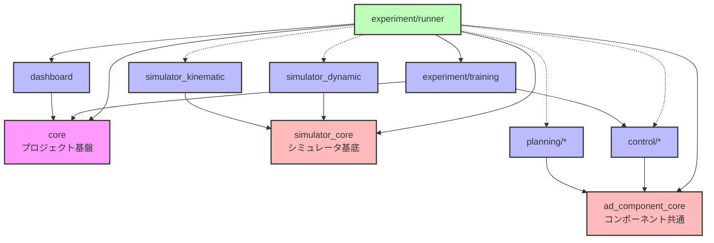

# E2E AI Challenge Playground

自動運転の認識・計画・制御コンポーネントを柔軟に組み合わせて実験できるプラットフォーム。

---

## 🚀 クイックスタート

### 必要な環境

- uv
- Docker

### セットアップと実行

```bash
# 1. リポジトリをクローン
git clone https://github.com/masahiro-kubota/e2e_aichallenge_playground.git
cd e2e_aichallenge_playground

# 2. 依存関係をインストール
uv sync

# 3. 実験トラッキングサーバーを起動（MLflow + MinIO）
cd mlflow
docker compose up -d
cd ..

# 4. 実験を実行

# データ収集（Pure Pursuit）
# データは自動的にMinIO (s3://datasets/...) にアップロードされます
uv run experiment-runner --config experiment/configs/experiments/data_collection_pure_pursuit.yaml

# 学習（Imitation Learning）
# MinIOからデータを自動ダウンロードして学習します
uv run experiment-runner --config experiment/configs/experiments/imitation_learning_s3.yaml

# 評価（Pure Pursuit）
uv run experiment-runner --config experiment/configs/experiments/pure_pursuit.yaml

# 5. 結果を確認
# MLflow UI: http://localhost:5000
# MinIO Console: http://localhost:9001 (minioadmin / minioadmin)
```

### サーバーの停止

```bash
cd mlflow
docker compose down  # データを保持
docker compose down -v  # データも削除
```

---

## 📊 CI/CD & Dashboard

| Status | Description |
| :--- | :--- |
| [](https://github.com/masahiro-kubota/e2e_aichallenge_playground/actions/workflows/integration-tests.yml) | 統合テスト・単体テスト（114テスト全て成功） |
| [](https://codecov.io/gh/masahiro-kubota/e2e_aichallenge_playground) | テストカバレッジ |
| [**Simulation Dashboard**](https://masahiro-kubota.github.io/e2e_aichallenge_playground/) | 最新のテスト結果（シミュレーションダッシュボード） |

---

## 📁 ディレクトリ構成

### アーキテクチャ

```
e2e_aichallenge_playground/
├── core/                           # プロジェクト基盤（データ構造・インターフェース）
├── ad_components/             # コンポーネントパッケージ
│   ├── core/                      # コンポーネント共通基盤
│   ├── planning/                  # 計画コンポーネント
│   │   ├── pure_pursuit/
│   │   └── planning_utils/
│   └── control/                   # 制御コンポーネント
│       ├── pid_controller/
│       └── neural_controller/
├── simulators/                    # シミュレータ実装
│   ├── core/                     # シミュレータ基底クラス (simulators_core)
│   ├── simulator_kinematic/      # 運動学シミュレータ
│   └── simulator_dynamic/        # 動力学シミュレータ
├── experiment/
│   ├── runner/                   # 統一実験実行フレームワーク
│   ├── training/                 # 学習機能（Dataset, Trainer）
│   └── configs/                  # 実験設定ファイル
│       ├── experiments/          # 実験設定
│       ├── vehicles/             # 車両パラメータ
│       └── scenes/               # シーン設定
├── dashboard/                    # 可視化ダッシュボード
├── data/                         # 一時データ（Git対象外）
└── mlflow/                       # MLflow + MinIO サーバー
```

### アーキテクチャ概要



---

## 📖 開発フロー

### 基本的な実験実行

```bash
# Pure Pursuit コントローラーでシミュレーション
uv run experiment-runner --config experiment/configs/experiments/pure_pursuit.yaml

# Imitation Learning（ニューラルコントローラー）でシミュレーション
uv run experiment-runner --config experiment/configs/experiments/imitation_learning.yaml
```

### テストの実行

> **注意**: ROSがインストールされている環境では、`PYTHONPATH`環境変数にROSのパスが含まれているため、pytestが干渉を受けます。`PYTHONPATH=""`を付けてテストを実行してください。

```bash
# 全テストの実行
PYTHONPATH="" uv run pytest

# 統合テストの実行
PYTHONPATH="" uv run pytest -m integration -v

# 統合テストを除外（単体テストのみ）
PYTHONPATH="" uv run pytest -m "not integration"

# 特定のテストファイルを実行
PYTHONPATH="" uv run pytest core/tests/test_config.py -v

# Pre-commitフックの実行（全ファイル）
uv run pre-commit run --all-files
```


### コンポーネントの組み合わせ

設定ファイルでコンポーネントを自由に組み合わせ：

```yaml
# experiment/configs/experiments/custom.yaml
experiment:
  name: "custom_experiment"
  type: "evaluation"
  description: "Custom experiment example"

simulator:
  type: "simulator_kinematic.KinematicSimulator"
  params:
    dt: 0.1
    track_file: "data/tracks/raceline_awsim_1500.csv"

components:
  planning:
    type: "pure_pursuit.PurePursuitPlanner"
    params:
      lookahead_distance: 5.0

  control:
    type: "pid_controller.PIDController"
    params:
      kp: 1.0
```
