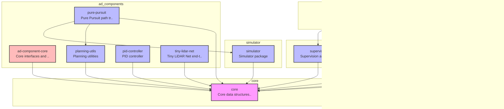

# E2E AI Challenge Playground

自動運転の認識・計画・制御コンポーネントを柔軟に組み合わせて実験できるプラットフォーム。

---

## 🚀 クイックスタート

### 必要な環境

- uv
- Docker

### セットアップと実行

```bash
# 1. リポジトリをクローン
git clone https://github.com/masahiro-kubota/e2e_aichallenge_playground.git
cd e2e_aichallenge_playground

# 2. 依存関係をインストール
uv sync

# 3. 実験トラッキングサーバーを起動（MLflow + MinIO）
cd mlflow
docker compose up -d
cd ..

# 4. 実験を実行 (追跡用環境変数の指定が必須です)
# デフォルト実行 (Pure Pursuit, 60秒)
MLFLOW_TRACKING_URI=http://localhost:5000 uv run experiment-runner

# パラメータを上書き
MLFLOW_TRACKING_URI=http://localhost:5000 uv run experiment-runner execution.duration_sec=10.0

# エージェントを切り替え (Tiny LiDAR Net)
MLFLOW_TRACKING_URI=http://localhost:5000 uv run experiment-runner agent=tiny_lidar agent.model_path=models/tinylidarnet_v2.npy

# 5. 結果を確認
# MLflow UI: http://localhost:5000
# MinIO Console: http://localhost:9001 (minioadmin / minioadmin)
```

### サーバーの停止

```bash
cd mlflow
docker compose down  # データを保持
docker compose down -v  # データも削除
```

---

## 🔍 生成物の確認手順

実験や学習の結果が正しく保存されているかは、以下のツールで確認できます。

### 1. 実験の履歴とサマリー (MLflow)
ブラウザで [http://localhost:5000](http://localhost:5000) にアクセスします。
- **履歴**: 実行されたすべてのフェーズ（Collect, Train, Eval等）が一覧表示されます。
- **設定**: 各実行の `Parameters` セクションで、Hydra の設定値を確認できます。
- **成果物 (Artifacts)**: `Artifacts` セクションに、`config.yaml` や学習済みモデル（`.pth`, `.npy`, `.onnx`）、評価ダッシュボード（`dashboard.html`）が保存されます。

### 2. ファイルの実体 (MinIO)
ブラウザで [http://localhost:9001](http://localhost:9001) にアクセスします（ID/PW: `minioadmin`）。
- **`mlflow` バケット**: MLflow で記録したモデルやログの実体が保存されています。
- **`dvc-storage` バケット**: `dvc push` した大容量データやモデルの重みが保存されます。

### 3. 大容量データのバージョン (DVC)
ローカルで以下のコマンドを実行します。
```bash
# 管理対象のファイル一覧を確認
uv run dvc list .

# リモート（MinIO）との同期状態を確認
uv run dvc status
```

---

## 📊 CI/CD & Dashboard

| Status | Description |
| :--- | :--- |
| [](https://github.com/masahiro-kubota/e2e_aichallenge_playground/actions/workflows/unit-tests.yml) | 単体テスト |
| [](https://github.com/masahiro-kubota/e2e_aichallenge_playground/actions/workflows/integration-tests.yml) | 統合テスト |
| [](https://codecov.io/gh/masahiro-kubota/e2e_aichallenge_playground) | テストカバレッジ |
| [**Simulation Dashboard**](https://masahiro-kubota.github.io/e2e_aichallenge_playground/) | 最新のテスト結果（シミュレーションダッシュボード） |
| [**Sphinx Documentation**](https://masahiro-kubota.github.io/e2e_aichallenge_playground/docs/) | プロジェクトドキュメント (API Reference) |

---

## 📁 ディレクトリ構成

```
e2e_aichallenge_playground/
├── core/                           # プロジェクト基盤（データ構造・インターフェース）
├── ad_components/             # コンポーネントパッケージ
│   ├── planning/                  # 計画コンポーネント
│   └── control/                   # 制御コンポーネント
├── simulator/                     # シミュレータ実装
├── experiment/                    # 実験フレームワーク
│   ├── conf/                     # Hydra設定 (YAML)
│   ├── tools/                    # 便利ツール (profile, diagram等)
│   └── src/
│       └── experiment/           # 実験実行メインロジック
│           ├── engine/           # ライフサイクル管理 (Collect, Extract, Train, Eval)
│           ├── core/             # Orchestrator, Structures
│           ├── data/             # Dataset, DataLoading
│           └── models/           # 模型定義 (TinyLidarNet)
├── dashboard/                    # 可視化ダッシュボード
├── supervisor/                   # シミュレート監視・判定
├── logger/                       # ログ記録
├── mlflow/                       # MLflow + MinIO サーバー
└── models/                       # 学習済みモデル (.npy)
```

### アーキテクチャ概要

> **Note**: この図は `experiment/tools/generate_architecture_diagram.py` によって自動生成されています。更新する際は以下のコマンドを実行してください：
> ```bash
> uv run python experiment/tools/generate_architecture_diagram.py
> ```

<!-- ARCHITECTURE_DIAGRAM_START -->

<!-- ARCHITECTURE_DIAGRAM_END -->

---

## 🏗️ アーキテクチャ詳細

### 1. 実行モデル

本プラットフォームは、すべてのコンポーネント（Simulator, Planning, Control等）を単一プロセス内の**Node**として実行します。各ノードは同期的に実行され、決定論的なシミュレーションと高速な実行を実現します。

### 2. ライフサイクル管理 (Engine)

実験は「フェーズ」ごとに Engine として抽象化されています。

- **CollectorEngine**: シミュレーションを実行し、生データ (MCAP) を収集。
- **ExtractorEngine**: MCAPから特徴量を抽出し、統計量 (stats.json) を計算。
- **TrainerEngine**: 抽出されたデータと統計量を用いて学習を実行。
- **EvaluatorEngine**: 学習済みモデルを用いて閉ループ評価を実行。

---

## 📖 開発フロー

### パフォーマンスプロファイリング

`experiment-runner`の実行時間を計測し、ボトルネックを特定できます。

```bash
# 実行時間を指定（例：5秒間実行してプロファイリング）
uv run python experiment/tools/profile_experiment.py --duration 5

# rateを指定（例：1000Hzでプロファイリング）
uv run python scripts/profile_experiment.py --rate 1000
```

### テストの実行

```bash
# 全テストの実行
PYTHONPATH="" uv run pytest

# 統合テストの実行
PYTHONPATH="" uv run pytest -m integration -v -s

# 統合テストを除外（単体テストのみ）
PYTHONPATH="" uv run pytest -m "not integration"

# 特定のテストファイルを実行
PYTHONPATH="" uv run pytest core/tests/test_config.py -v

# Pre-commitフックの実行（全ファイル）
uv run pre-commit run --all-files
```

---

## 🔄 MLOps ワークフロー (Tiny LiDAR Net)

エンドツーエンドの学習パイプラインを実行する手順です。

### 1. データ収集 (Collect)

Hydraを使用してパラメータをランダム化し、生データを収集します。

```bash
# 学習データ
MLFLOW_TRACKING_URI=http://localhost:5000 uv run experiment-runner experiment=data_collection execution.num_episodes=100 +split=train

# 検証データ
MLFLOW_TRACKING_URI=http://localhost:5000 uv run experiment-runner experiment=data_collection execution.num_episodes=20 +split=val
```

### 2. データ抽出・統計計算 (Extract)

MCAPから `scans.npy`, `steers.npy` 等を抽出し、**統計量 (Standardization)** を計算します。

```bash
# 学習データ
uv run experiment-runner experiment=extraction input_dir=outputs/latest/train/raw_data output_dir=data/train_set

# 検証データ
uv run experiment-runner experiment=extraction input_dir=outputs/latest/val/raw_data output_dir=data/val_set
```

### 3. 学習 (Train)

抽出されたデータと統計量を用いて学習します。統計量は自動的に適用されます。

```bash
MLFLOW_TRACKING_URI=http://localhost:5000 uv run experiment-runner experiment=training \
    training.num_epochs=50 \
    train_data=data/train_set \
    val_data=data/val_set
```

### 4. モデル変換 (工具)

学習済みモデル (PyTorch) をシミュレータ用 (NumPy) に変換します。

```bash
uv run python experiment/tools/convert_model.py \
    --ckpt outputs/latest/training/checkpoints/best_model.pth \
    --output models/tinylidarnet_v1.npy
```

### 5. 評価 (Eval)

学習したモデルを使ってシミュレーションを実行します。

```bash
MLFLOW_TRACKING_URI=http://localhost:5000 uv run experiment-runner experiment=evaluation \
    agent=tiny_lidar \
    agent.model_path=models/tinylidarnet_v1.npy
```
