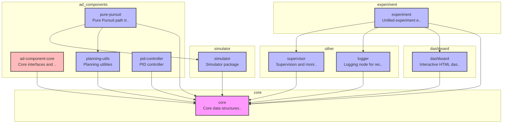

# E2E AI Challenge Playground

自動運転の認識・計画・制御コンポーネントを柔軟に組み合わせて実験できるプラットフォーム。

---

## 🚀 クイックスタート

### 必要な環境

- uv
- Docker

### セットアップと実行

```bash
# 1. リポジトリをクローン
git clone https://github.com/masahiro-kubota/e2e_aichallenge_playground.git
cd e2e_aichallenge_playground

# 2. 依存関係をインストール
uv sync

# 3. 実験トラッキングサーバーを起動（MLflow + MinIO）
cd mlflow
docker compose up -d
cd ..

# 4. 実験を実行
# 評価（Pure Pursuit）
uv run experiment-runner --config experiment/configs/experiments/default_experiment.yaml

# 5. 結果を確認
# MLflow UI: http://localhost:5000
# MinIO Console: http://localhost:9001 (minioadmin / minioadmin)
```

### サーバーの停止

```bash
cd mlflow
docker compose down  # データを保持
docker compose down -v  # データも削除
```

---

## 📊 CI/CD & Dashboard

| Status | Description |
| :--- | :--- |
| [](https://github.com/masahiro-kubota/e2e_aichallenge_playground/actions/workflows/unit-tests.yml) | 単体テスト |
| [](https://github.com/masahiro-kubota/e2e_aichallenge_playground/actions/workflows/integration-tests.yml) | 統合テスト |
| [](https://codecov.io/gh/masahiro-kubota/e2e_aichallenge_playground) | テストカバレッジ |
| [**Simulation Dashboard**](https://masahiro-kubota.github.io/e2e_aichallenge_playground/) | 最新のテスト結果（シミュレーションダッシュボード） |
| [**Sphinx Documentation**](https://masahiro-kubota.github.io/e2e_aichallenge_playground/docs/) | プロジェクトドキュメント (API Reference) |

---

## 📁 ディレクトリ構成

```
e2e_aichallenge_playground/
├── core/                           # プロジェクト基盤（データ構造・インターフェース）
├── ad_components/             # コンポーネントパッケージ
│   ├── core/                      # コンポーネント共通基盤
│   ├── planning/                  # 計画コンポーネント
│   │   ├── pure_pursuit/
│   │   └── planning_utils/
│   └── control/                   # 制御コンポーネント
│       ├── pid_controller/
│       └── neural_controller/
├── simulator/                     # シミュレータ実装
├── experiment/                    # 実験フレームワーク
│   ├── configs/                  # 実験設定ファイル
│   │   ├── experiments/          # 実験設定
│   │   ├── modules/              # モジュール設定(ADコンポーネント構成)
│   │   ├── scenes/               # シーン設定
│   │   ├── systems/              # システム設定(車両・シーン・モジュールの組み合わせ)
│   │   └── vehicles/             # 車両パラメータ
│   └── src/
│       └── experiment/           # 実験実行メインロジック
│           ├── runner/           # 実行エンジン
│           ├── postprocessing/   # 後処理 (評価・可視化)
│           └── preprocessing/    # 前処理 (Config解析)
├── dashboard/                    # 可視化ダッシュボード
├── supervisor/                   # シミュレーション監視・判定
├── logger/                       # ログ記録
├── data/                         # 一時データ(Git対象外)
└── mlflow/                       # MLflow + MinIO サーバー
```

### アーキテクチャ概要

> **Note**: この図は `scripts/generate_architecture_diagram.py` によって自動生成されています。更新する際は以下のコマンドを実行してください：
> ```bash
> uv run python scripts/generate_architecture_diagram.py
> ```

<!-- ARCHITECTURE_DIAGRAM_START -->

<!-- ARCHITECTURE_DIAGRAM_END -->

---

## 🏗️ アーキテクチャ詳細

### 1. 実行モデル

本プラットフォームは、すべてのコンポーネント（Simulator, Planning, Control等）を単一プロセス内の**Node**として実行します。各ノードは同期的に実行され、決定論的なシミュレーションと高速な実行を実現します。

### 2. ノードシステム

すべてのコンポーネントは共通の`Node`基底クラスを継承します。

- **型安全な設定**: Pydanticモデルによる厳密なパラメータ検証。
- **統一インターフェース**: `on_run(current_time)` メソッドによる処理の実装。
- **Config-Driven**: 依存関係（車両パラメータ等）はYAMLから明示的に注入されます。

```python
class Node(ABC, Generic[ConfigT]):
    """実行可能なノードの基底クラス"""

    def __init__(self, name: str, rate_hz: float, config: ConfigT):
        self.config = config  # Pydanticで検証済みの設定

    @abstractmethod
    def on_run(self, current_time: float) -> NodeExecutionResult:
        pass
```

### 🛠️ 新しいノードの追加方法

新しいコンポーネントやアルゴリズムを追加する場合の手順です。

#### 1. Nodeの実装

`Node` クラスを継承し、PydanticでConfigを定義します。

```python
from pydantic import Field
from core.interfaces.node import Node, NodeConfig

class MyAlgorithmConfig(NodeConfig):
    param_a: float = Field(..., description="Important parameter")
    file_path: str = Field(..., description="Path to model file")

class MyAlgorithmNode(Node[MyAlgorithmConfig]):
    def __init__(self, config: MyAlgorithmConfig, rate_hz: float):
        super().__init__("MyAlgorithm", rate_hz, config)

    def on_run(self, current_time: float) -> NodeExecutionResult:
        # Implementation...
        return NodeExecutionResult.SUCCESS
```

#### 2. Entry Pointの登録（推奨）

`pyproject.toml` に登録することで、YAML設定ファイルで短いエイリアス名を使用できるようになります。

```toml
[project.entry-points."e2e_aichallenge.node"]
my_algorithm = "my_package.my_module:MyAlgorithmNode"
```

#### 3. YAML設定での利用

```yaml
    - name: "MyComponent"
      type: "my_algorithm"
      params:
        param_a: 1.0
        file_path: "models/model.pt"
      rate_hz: 20.0

```

---

## 📖 開発フロー

### 基本的な実験実行

```bash
uv run experiment-runner --config experiment/configs/experiments/default_experiment.yaml
```

### テストの実行

> **注意**: ROSがインストールされている環境では、`PYTHONPATH`環境変数にROSのパスが含まれているため、pytestが干渉を受けます。`PYTHONPATH=""`を付けてテストを実行してください。

```bash
# 全テストの実行
PYTHONPATH="" uv run pytest

# 統合テストの実行
PYTHONPATH="" uv run pytest -m integration -v

# 統合テストを除外（単体テストのみ）
PYTHONPATH="" uv run pytest -m "not integration"

# 特定のテストファイルを実行
PYTHONPATH="" uv run pytest core/tests/test_config.py -v

# Pre-commitフックの実行（全ファイル）
uv run pre-commit run --all-files
```
