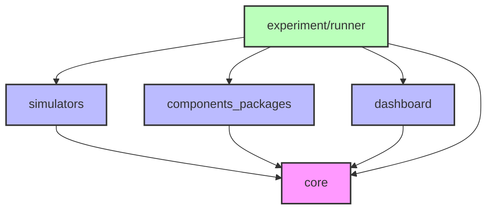
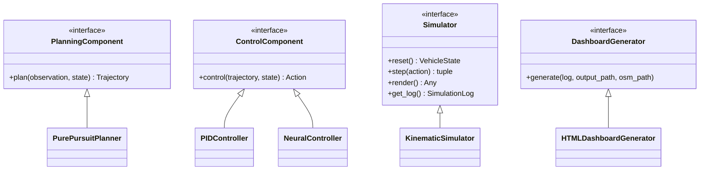

# E2E AI Challenge Playground

自動運転の認識・計画・制御コンポーネントを柔軟に組み合わせて実験できる、モジュラーな研究プラットフォームです。

---

## 🚀 クイックスタート

### 必要な環境

- uv
- Docker

### セットアップと実行

```bash
# 1. リポジトリをクローン
git clone https://github.com/masahiro-kubota/e2e_aichallenge_playground.git
cd e2e_aichallenge_playground

# 2. 依存関係をインストール
uv sync

# 3. 実験トラッキングサーバーを起動（MLflow + MinIO）
cd mlflow
docker compose up -d
cd ..

# 4. シミュレーションを実行
uv run experiment-runner --config experiment/configs/experiments/pure_pursuit.yaml

# 5. 結果を確認
# MLflow UI: http://localhost:5000
# MinIO Console: http://localhost:9001 (minioadmin / minioadmin)
```

### サーバーの停止

```bash
cd mlflow
docker compose down  # データを保持
docker compose down -v  # データも削除
```

---

## 📊 CI/CD & Dashboard

| Status | Description |
| :--- | :--- |
| [](https://github.com/masahiro-kubota/e2e_aichallenge_playground/actions/workflows/integration-tests.yml) | 最新の統合テスト実行ステータス |
| [**Simulation Dashboard**](https://masahiro-kubota.github.io/e2e_aichallenge_playground/) | 最新のテスト結果（シミュレーションダッシュボード） |

---

## 📁 ディレクトリ構成

### アーキテクチャ方針

このプロジェクトは**プラグイン型モジュラーアーキテクチャ**を採用しています：

```
e2e_aichallenge_playground/
├── core/                           # コアフレームワーク
├── experiment/runner/              # 統一実験実行フレームワーク
├── simulators/                     # シミュレータ実装
├── components_packages/            # コンポーネントパッケージ
│   ├── planning/                   # 計画コンポーネント
│   │   ├── pure_pursuit/
│   │   └── planning_utils/
│   └── control/                    # 制御コンポーネント
├── experiment/configs/             # 実験設定ファイル
│   └── experiments/                # 実験設定
│       ├── pure_pursuit.yaml
│       └── imitation_learning.yaml
├── data/                           # データ(.gitignore、MLflow/W&Bで管理)
└── mlflow/     # MLflow + MinIO サーバー
```

### アーキテクチャ概要

本プロジェクトは、明確な責務分離と依存関係を持つモジュラーアーキテクチャを採用しています。



### コアインターフェース

`core` パッケージは、全てのコンポーネントが準拠すべきインターフェースを定義しています。



### パッケージ詳細

#### 📦 `core/` - コアフレームワーク
**責務**: プロジェクト全体の基盤となるデータ構造とインターフェース定義。
- **Interfaces**: `PlanningComponent`, `ControlComponent`, `Simulator`, `DashboardGenerator`
- **Data Types**: `VehicleState`, `Trajectory`, `Action`, `Observation`, `SimulationLog`
- **Utils**: 幾何計算、座標変換

**依存関係**: なし（最下層）

#### 🎮 `simulators/` - シミュレータ実装
**責務**: 車両運動モデルと環境のシミュレーション。
- **Kinematic**: 自転車モデルに基づく運動学シミュレータ
- **Dynamic**: (WIP) 動力学シミュレータ

**依存関係**: `core`

#### 🧩 `components_packages/` - 自動運転コンポーネント
**責務**: 認識・計画・制御のアルゴリズム実装。
- **Planning**: `PurePursuitPlanner` (経路追従), `PlanningUtils`
- **Control**: `PIDController` (縦横制御), `NeuralController` (学習ベース)

**依存関係**: `core`

#### 📊 `dashboard/` - 可視化ダッシュボード
**責務**: シミュレーション結果の可視化と分析。
- **Python Package**: `HTMLDashboardGenerator` (ログデータの注入、HTML生成)
- **Frontend**: React + Vite + Recharts によるインタラクティブな可視化
- **Assets**: 地図データ (`lanelet2_map.osm`)

**依存関係**: `core`

#### 🧪 `experiment/runner/` - 実験実行フレームワーク
**責務**: 設定ファイルに基づいたコンポーネントの組み立てと実験ループの実行。
- **Config**: YAML設定の読み込みと検証
- **Runner**: シミュレーションループの実行、メトリクス計算、MLflow記録
- **Integration**: 各コンポーネントとダッシュボードの統合

**依存関係**: `core`, `simulators`, `components_packages`, `dashboard`

---

## 📖 開発フロー

### 基本的な実験実行

```bash
# Pure Pursuit コントローラーでシミュレーション
uv run experiment-runner --config experiment/configs/experiments/pure_pursuit.yaml

# Imitation Learning（ニューラルコントローラー）でシミュレーション
uv run experiment-runner --config experiment/configs/experiments/imitation_learning.yaml
```

### テストの実行

```bash
# ユニットテストの実行
uv run pytest

# 統合テストの実行
uv run pytest experiment/runner/tests -m integration -v
```

### 開発用ツールのセットアップ

```bash
# 開発用依存関係（pre-commit等）をインストール
uv sync --extra dev
uv run pre-commit install
```

### コンポーネントの組み合わせ

設定ファイルでコンポーネントを自由に組み合わせ：

```yaml
# experiment/configs/experiments/custom.yaml
experiment:
  name: "custom_experiment"
  simulator: "simple_2d"

simulator:
  track_file: "data/tracks/raceline_awsim_1500.csv"

components:
  planning:
    type: "pure_pursuit"  # または "neural_planner"
    config:
      lookahead_distance: 5.0

  control:
    type: "pid"  # または "neural_controller"
    config:
      kp: 1.0
```
