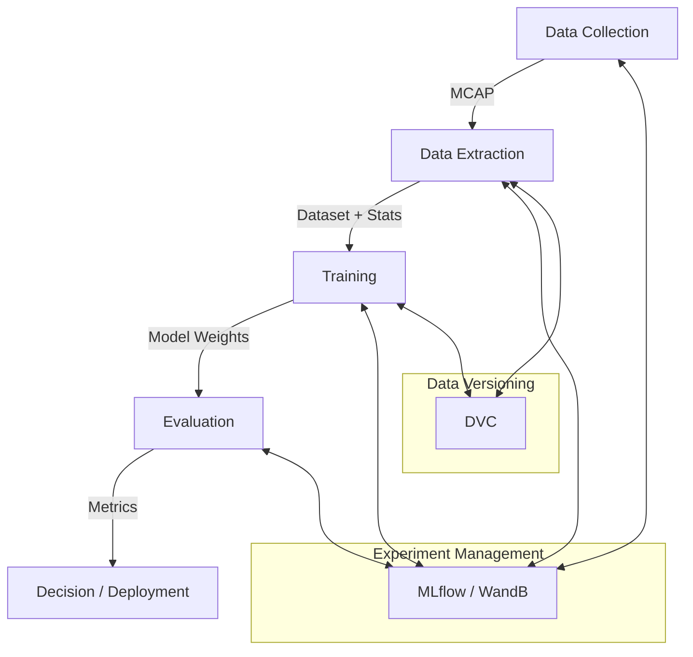

# Tiny Lidar Net MLOps Flow

このドキュメントでは、Tiny Lidar Net（LiDARベースの回避モデル）を用いた自動運転AIの開発において、理想的なデータ収集、学習、評価のフローを記述します。

---

## 🏗️ 全体アーキテクチャ

実験管理に **MLflow / WandB**、データ管理に **DVC**、設定管理に **Hydra** を活用した、再現性の高いMLパイプラインを目指します。



---

## 📂 データとアーティファクトの構成推移

各フェーズにおけるディレクトリ構成の推移と、最終生成物の配置は以下の通りです。

### 1. データ収集 (Raw Data)
Hydra Joblib Launcherにより、ジョブ（シード）ごとに分散して保存されます。
```text
outputs/YYYY-MM-DD/HH-MM-SS/   <-- Hydra Multirun Root
├── 0/
│   └── train/raw_data/episode_seed100/
│       ├── simulation.mcap    <-- 生ログ
│       ├── result.json        <-- 成功可否
│       └── config.yaml
├── 1/
│   └── train/raw_data/episode_seed101/
└── ...
```

### 2. データ抽出・結合 (Dataset)
`extractor` により、成功データのみが抽出・結合され、フラットで扱いやすい形式になります。
このディレクトリは **DVC** でバージョン管理されます。
```text
data/
└── processed/v1.0/            <-- DVC managed
    ├── metadata.json
    ├── stats.json             <-- 正規化用統計値（平均・分散）
    ├── scans.npy              <-- 結合されたLiDARデータ (N, 1080)
    └── actions.npy            <-- 結合された制御入力 (N, 2)
```

### 3. 学習・モデル (Model Artifacts)
MLflowにより、学習済みモデルと付帯情報がパッケージングされます。
推論時はこのディレクトリを参照するだけで動作するようにします。
```text
mlruns/
└── <ExpID>/<RunID>/artifacts/model/
    ├── model.pth              <-- 学習済み重み
    ├── config.yaml            <-- モデル構成設定
    └── stats.json             <-- 学習時に使用した統計値（推論時の正規化に必須）
```

---

## 1. データ収集 (Data Collection)

多様なシナリオでの走行データを効率的に、かつ再現性を持って収集します。

### 並列データ収集 (推奨)
Hydraの **Joblib Launcher** を使用して複数のエピソードを並列実行し、高速にデータを収集します。
各ジョブで `seed` を変え、`num_episodes=1` とすることで重複なく大量のエピソードを生成できます。

- **実行例**:
  ```bash
  # data_collection_parallel設定を使用して並列実行
  # 並列数などは data_collection_parallel.yaml で設定済み（Joblib使用、GUI無効化など）
  uv run experiment-runner -m \
    experiment=data_collection_parallel \
    env.obstacles.generation.seed="range(100,105)" \
    split=train
  ```

  **効果**: Joblib Launcherを使用することで、直列実行と比較して **約4.4倍** の高速化を確認しています（50エピソード実行時: 382秒 -> 87秒）。
  > [!NOTE]
  > `collector` は内部ループで `seed` をインクリメントしながら `num_episodes` 分のエピソードを生成します（例: seed=100 -> 100, 101, 102...）。
  > そのため、Multirunでシードをスイープする場合は、設定した `num_episodes` 以上の間隔を空けてください。単純に `100, 101, 102` とするとシードが重複し、同じシナリオが繰り返し生成されてしまいます。
  >
  > [!IMPORTANT]
  > 大量試行時は必ず `postprocess.foxglove.auto_open=false` を設定してください。そうしないと、エピソードごとにFoxgloveが開き、システムがフリーズする可能性があります。


### データセット分割戦略 (Data Splitting)
**重要**: モデルの汎化性能を正しく評価するため、学習用（Train）と評価用（Test）のデータは、**シード値の範囲**によって厳密に分離します。

| データセット | 用途 | シード範囲例 | ディレクトリ名 (split) |
| :--- | :--- | :--- | :--- |
| **Training** | モデルの学習 | `0` 〜 `999` | `train` |
| **Validation** | 学習中のモデル選択・HP調整 | `10000` 〜 `10099` | `val` |
| **Test** | 最終的な性能評価（未知のシナリオ） | `20000` 〜 `20099` | `test` |

#### 実行コマンド例

**1. 学習データの収集 (Train)**
```bash
# シード 0〜999 (1000エピソード)
uv run experiment-runner -m \
  experiment=data_collection_parallel \
  env.obstacles.generation.seed="range(0,1000)" \
  split=train
```

**2. 評価データの収集 (Test)**
学習データとは全く異なるシード範囲を使用します。
```bash
# シード 20000〜20099 (100エピソード)
uv run experiment-runner -m \
  experiment=data_collection_parallel \
  env.obstacles.generation.seed="range(20000,20100)" \
  split=test
```

### エピソード管理
`collector` の設定により、シード値を含むディレクトリ名で保存されます（例: `episode_seed100`）。
これにより分散して保存された後も、どのシード（シナリオ）のデータかを容易に識別できます。


---

## 2. データセットの分析

シミュレーションで収集したデータ（`metrics`, `success` rate 等）は、各エピソードの `result.json` に保存されます。以下のスクリプトを実行することで、これらの結果を集計できます。

```bash
# 直近の実行結果を自動で検出して集計（推奨）
uv run python summarize_results.py

# 特定のディレクトリを指定して集計
uv run python summarize_results.py outputs/2025-XX-XX/HH-MM-SS
```

このスクリプトは指定されたディレクトリ以下のすべての `result.json` を探索し、以下の情報を出力します：
- 総エピソード数
- 成功率
- 失敗理由の分布（衝突など）
- メトリクスの平均値

また、集計結果は `aggregated_results.csv` として保存されます。

---

## 3. データ抽出・選別 (Extraction & Filtering)

生ログ（MCAP）から、学習に適した「クリーンな」データセットを構築します。

### 回避成功データのみを抽出 (Behavioral Cloning)
**重要**: AIに「正しい回避行動」を学習させるため、シミュレーションで衝突（Failed）したデータは学習セットから除外します。

- **フィルタリング・ロジック**: `result.json` を参照し、`success: true` のエピソードのみを処理対象とします。
- **同期**: LiDARスキャン時刻と制御入力（ステアリング、アクセル）をタイムスタンプベースで同期し、学習ペアを作成します。
- **整合性チェック**: 抽出時にデータの周波数（LiDAR: 10Hz, Control: 30Hz）を自動検出し、設定値から乖離している場合は警告を出します。
- **正規化用統計**: 抽出時にデータセット全体の平均・標準偏差を計算し `stats.json` として保存します。

#### 実行コマンド例（Train/Valの分割抽出）
学習用（Train）と検証用（Validation）のデータを個別に抽出します。

```bash
# 学習データ (Train) の抽出
# input_dir: Trainデータ収集の出力ディレクトリを指定
uv run experiment-runner -m \
  experiment=extraction \
  input_dir=outputs/YYYY-MM-DD/HH-MM-SS_TRAIN \
  output_dir=data/processed/train_v1

# 検証データ (Val) の抽出
# input_dir: Valデータ収集の出力ディレクトリを指定
uv run experiment-runner -m \
  experiment=extraction \
  input_dir=outputs/YYYY-MM-DD/HH-MM-SS_VAL \
  output_dir=data/processed/val_v1
```

---

## 4. 学習 (Training)

実験の過程を完全に追跡可能にします。

### 実験管理 (Tracking)
- **MLflow**: 各学習ランのパラメータ、メトリクス、モデルアーティファクトを記録。
- **WandB**: 学習曲線、勾配の可視化、システムのメトリクス（GPU使用率等）をリアルタイム監視。

### データの履歴管理 (Lineage)
- DVC を使用して、どのバージョンのデータセットを使用して学習したかをモデルと紐付けます。
- `stats.json` を使用して学習時にデータをオンライン正規化します。

#### 実行コマンド例
作成したTrain/Valデータセットを指定して学習を実行します。

```bash
uv run experiment-runner -m \
  experiment=training \
  train_data=data/processed/train_v1 \
  val_data=data/processed/val_v1 \
  training.num_epochs=50 \
  training.batch_size=32
```

---

## 5. 評価 (Evaluation)

モデルの汎化性能を定量的・定性的に検証します。


### 再現性のあるベンチマーク
学習済みモデルの評価は、**Test用シードセット（例：20000〜20099）** を使用して行います。学習時に一度も見たことのない障害物配置で走行させることで、真の汎化性能を測定します。

#### 評価実行コマンド

学習済みモデルを使用して評価を実行します。
`ad_components=tiny_lidar` を指定し、`experiment` を `evaluation` に設定します。また、評価対象のモデルパスを指定する必要があります。

> [!IMPORTANT]
> 現在の実装では、`tiny_lidar_net` ノードは `.npy` 形式の重みファイルを必要とします（`.onnx` ではなく）。学習出力の `checkpoints` ディレクトリにある `best_model.npy` を指定してください。

**1. 障害物なし環境での評価（基本性能確認）**
```bash
# 経路追従能力の確認
uv run experiment-runner -m \
  experiment=evaluation \
  env=no_obstacle \
  ad_components=tiny_lidar \
  ad_components.model_path=$(pwd)/outputs/YYYY-MM-DD/HH-MM-SS/checkpoints/best_model.npy \
  ad_components.nodes.tiny_lidar_net.params.model_path=$(pwd)/outputs/YYYY-MM-DD/HH-MM-SS/checkpoints/best_model.npy
```

**2. 障害物あり環境での評価（汎化性能確認）**
```bash
# 未学習のシナリオ（Testセット: Seed 20000-20099）で評価
uv run experiment-runner -m \
  experiment=evaluation \
  ad_components=tiny_lidar \
  ad_components.model_path=$(pwd)/outputs/YYYY-MM-DD/HH-MM-SS/checkpoints/best_model.npy \
  ad_components.nodes.tiny_lidar_net.params.model_path=$(pwd)/outputs/YYYY-MM-DD/HH-MM-SS/checkpoints/best_model.npy \
  env.obstacles.generation.seed="range(20000,20005)" \
  execution.num_episodes=1
```

**3. 評価ベンチマーク（障害物なし + 障害物あり複数ケースを1セット実行）**

便利なシェルスクリプトを用意しています。モデルのチェックポイントディレクトリを指定するだけで実行できます。

```bash
# シェルスクリプトを使用（推奨）
./run_evaluation_benchmark.sh outputs/YYYY-MM-DD/HH-MM-SS/checkpoints
```

または、直接コマンドで実行する場合:

```bash
# 障害物なし1ケース + 障害物あり5ケースを一度に評価
uv run experiment-runner -m \
  experiment=evaluation \
  ad_components=tiny_lidar \
  ad_components.model_path=$(pwd)/outputs/YYYY-MM-DD/HH-MM-SS/checkpoints/best_model.npy \
  ad_components.nodes.tiny_lidar_net.params.model_path=$(pwd)/outputs/YYYY-MM-DD/HH-MM-SS/checkpoints/best_model.npy \
  'env=no_obstacle,default,default,default,default,default' \
  'env.obstacles.generation.seed=null,20000,20001,20002,20003,20004'
```

> [!TIP]
> 上記のコマンドは6つのジョブを並列実行します:
> - Job 0: 障害物なし環境
> - Job 1-5: 障害物あり環境（Seed 20000-20004）
>
> 結果は `outputs/YYYY-MM-DD/HH-MM-SS/0/`, `outputs/YYYY-MM-DD/HH-MM-SS/1/`, ... に保存されます。

- **Metrics**:
- 評価専用のシード値セットを使用し、未学習のシナリオで評価します。
- **成功率 (Success Rate)**、**衝突までの平均距離 (MPC)**、**チェックポイント通過率** などをメトリクスとして算出します。
- 各エピソードの結果は `result.json` として保存され、`summarize_results.py` で集計可能です。

### デバッグと可視化
- 評価時の全走行をMCAPとして記録。
- **Foxglove** や **Dashboard** を使用して、AIがどこで・なぜ失敗したかを視覚的に分析します。

---

## 💡 今後の改善ロードマップ

1.  **失敗データの活用 (Hard Negative Mining)**: 衝突エピソード周辺েরデータを「やってはいけない行動」として強化学習や対照学習に利用する。
2.  **データオーギュメンテーション**: LiDARスキャンへのノイズ付加や、オフセットを加えた擬似的な位置からのスキャン生成。
3.  **自動化パイプライン**: `experiment-runner` を CI/CD ツールと連携させ、コードの変更ごとに自動でベンチマーク評価を実行。
