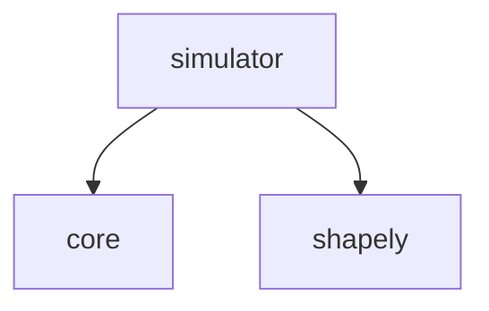

# Simulator

シミュレーション環境を提供するパッケージです。

## パッケージ構成

- **`simulator`**: シミュレータのメインパッケージ。
- **`simulator.simulator`**: `Simulator`クラス(シミュレーションの実行管理)。
- **`simulator.state`**: 車両状態定義(`SimulationVehicleState`)。
- **`simulator.dynamics`**: 車両運動モデル(バイシクルモデルなど)。
- **`simulator.map`**: マップ読み込み・判定(`LaneletMap`)。
- **`simulator.presets`**: プリセット設定(`KinematicSimulator`など)。

## アーキテクチャの主要な変更点

- **統一された内部状態**:
  全てのシミュレーターは、内部的に `SimulationVehicleState`（3D位置、姿勢、速度、加速度）を使用して状態を管理します。

- **構成（Composition）による拡張**:
  `Simulator`クラスは継承ではなく、関数注入（`step_update_func`, `get_vehicle_polygon_func`）によって振る舞いを変更できる構成になっています。

- **外部インターフェース**:
  外部（プランナーやコントローラー）とのやり取りには、標準の `VehicleState` と `Action` データクラスが使用されます。

## 依存関係

