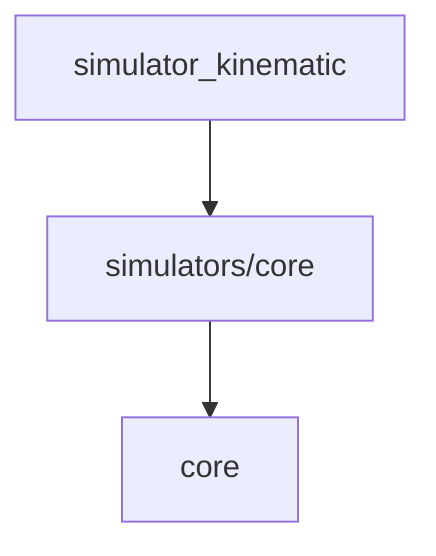

# Simulators

シミュレーション環境を提供するパッケージ群です。

## パッケージ構成

- **[core](./core/README.md)**: 全てのシミュレータの基底クラス、データ構造（`SimulationVehicleState`など）、共通ユーティリティ（ソルバー、マップなど）。
- **[simulator_kinematic](./simulator_kinematic/README.md)**: 自転車モデルに基づく運動学シミュレータ。

## アーキテクチャの主要な変更点

- **統一された内部状態**:
  全てのシミュレーターは、内部的に `SimulationVehicleState`（3D位置、姿勢、速度、加速度）を使用して状態を管理します。これにより、シミュレーター間での状態表現の一貫性が保たれます。

- **高精度な数値積分**:
  シミュレーションのステップ更新には、ルンゲ=クッタ法（RK4）が標準で使用され、オイラー法よりも高い精度と安定性を提供します。

- **外部インターフェース**:
  外部（プランナーやコントローラー）とのやり取りには、標準の `VehicleState` と `Action` データクラスが使用されます。内部状態との変換は基底クラスで自動的に処理されます。

## 依存関係

